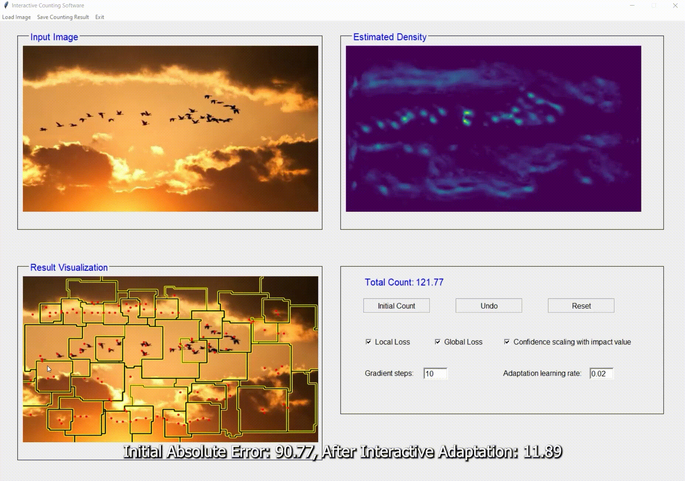

# **[ICCV23] Interactive Class-Agnostic Object Counting**

Our work using user interaction to improve class-agnostic visual counter.

[Project](https://yifehuang97.github.io/ICACountProjectPage/) [PDF](https://arxiv.org/abs/2309.05277)



## Contact
If you have any problems please contact yifehuang@cs.stonybrook.edu

## To-Do List
- [x] Colab
- [ ] Environment Set up
- [ ] Script for segment density map
- [ ] Script for Visualization 
- [ ] Original Interface
- [ ] Interface with exemplar providing
- [ ] Hugging Face


## Data and Checkpoints
Download on [Google Drive](https://drive.google.com/drive/folders/1uEFHgqmnsDugelC7bYGUnE32fWkz87Hs?usp=sharing) or: <br> 

Download data(FSC-147 and FSCD-LVIS)
```
wget --load-cookies /tmp/cookies.txt "https://docs.google.com/uc?export=download&confirm=$(wget --quiet --save-cookies /tmp/cookies.txt --keep-session-cookies --no-check-certificate 'https://docs.google.com/uc?export=download&id=1rI1dcUaR47EOQL3jJaRyjhF15ycHzUCU' -O- | sed -rn 's/.*confirm=([0-9A-Za-z_]+).*/\1\n/p')&id=1rI1dcUaR47EOQL3jJaRyjhF15ycHzUCU" -O data.zip && rm -rf /tmp/cookies.txt
```
The Data folder should be organized as follows:
- 📂 **Data**
  - 📂 **FSCD_LVIS**
    - 📂 **annotations**
    - 📂 **images**
    - 📂 **masks**
  - 📂 **FSC_147**
    - 📂 **annotations**
    - 📄 annotation_FSC147_384.json
    - 📂 **gt_density_map_adaptive_384_VarV2**
    - 📂 **images_384_VarV2**
    - 📄 ...

Download checkpoints(Checkpoints train on FSCD-LVIS):
```
wget --load-cookies /tmp/cookies.txt "https://docs.google.com/uc?export=download&confirm=$(wget --quiet --save-cookies /tmp/cookies.txt --keep-session-cookies --no-check-certificate 'https://docs.google.com/uc?export=download&id=1ljsiTu8NfUQ6x0cHlcX12iM8JQjeVRMr' -O- | sed -rn 's/.*confirm=([0-9A-Za-z_]+).*/\1\n/p')&id=1ljsiTu8NfUQ6x0cHlcX12iM8JQjeVRMr" -O checkpoints.zip && rm -rf /tmp/cookies.txt
```
The Checkpoints folder should be organized as follows:
- 📂 **Checkpoints**
  - 📂 **FSCD_LVIS**
    - 📄 BMNet.pth
    - 📄 ...
  - 📂 **FSC_147**
    - 📄 BMNet.pth
    - 📄 ...
## Experiment Reproduction
First update the checkpoint path and dataset path in the config file. <br>
Then run the following scripts. <br>

### ***!! Important note about reproducibility !!*** <br>
```
torch.nn.functional.interpolate
```
may produce nondeterministic gradients when given tensors on a CUDA device. See Reproducibility for more information.
[TORCH.NN.FUNCTIONAL.INTERPOLATE](https://pytorch.org/docs/stable/generated/torch.nn.functional.interpolate.html). <br>
In the context of interactive adaptation, it's important to note that the gradient is required. All three class-agnostic counters utilize nn.UpsamplingBilinear2d. As a result, you may observe slight variations in the output for each run. This behavior persists even when you fix the random seed and set torch.backends.cudnn.deterministic to true. <br>
The variance on SAFECount and BMNet is smaller, since the adaptation learning rate for these two counters are small.
### FamNet [](https://colab.research.google.com/drive/1JlaJi4tBtvbv6vL2LWAcy7LsER-vgIgB?usp=sharing)
FSC-147:
```
cd Scripts
sh famnet_fsc.sh
```
FSCD-LVIS
```
cd Scripts
sh famnet_lvis.sh
```
### BMNet
FSC-147:
```
cd Scripts
sh bmnet_fsc.sh
```
FSCD-LVIS
```
cd Scripts
sh bmnet_lvis.sh
```
### SAFECount
FSC-147:
```
cd Scripts
sh safecount_fsc.sh
```
FSCD-LVIS
```
cd Scripts
sh safecount_lvis.sh
```

